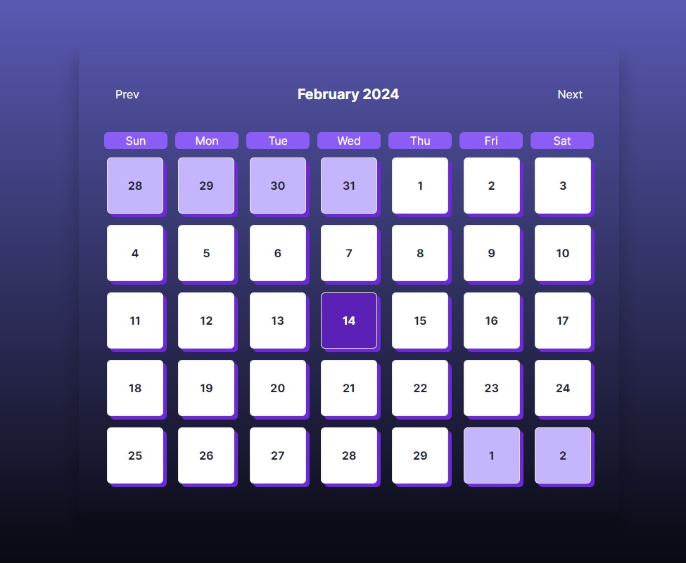

# Calendario personalizado con React Date-Fns y Tailwind v1.0.0

## Descripción Breve

Desarrollé un calendario personalizado utilizando React Date-Fns y Tailwind CSS. Este calendario permite una facil personalizacion por medio de estilos "in line" con tailwind o bien con css.



La base del proyecto es NextJs:

```bash
npm run dev
# or
yarn dev
# or
pnpm dev
# or
bun dev
```
